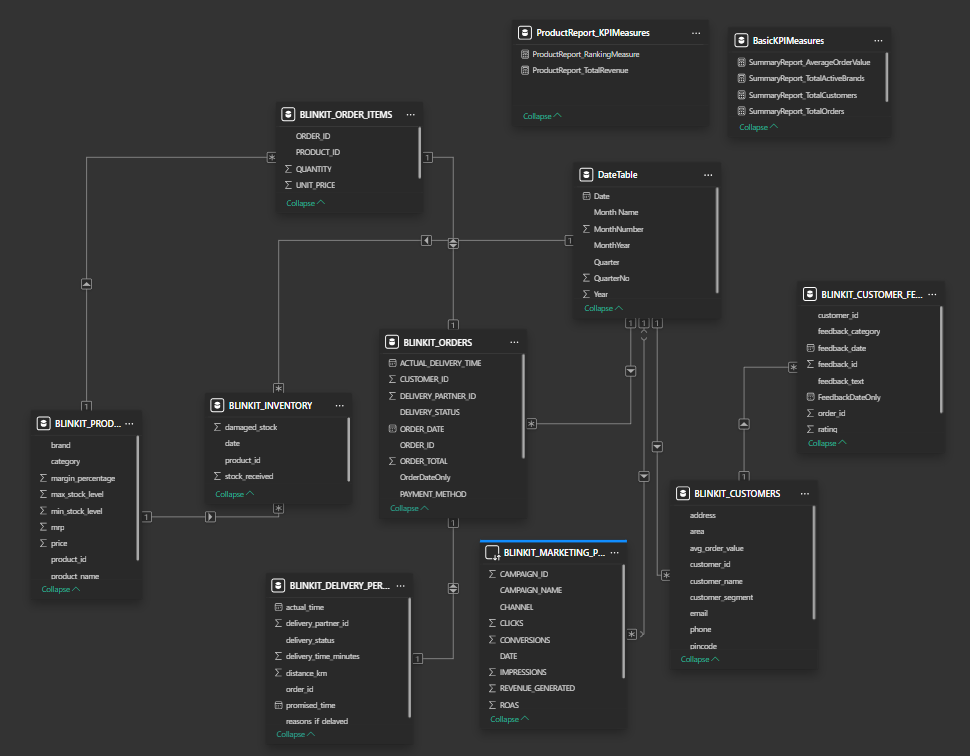
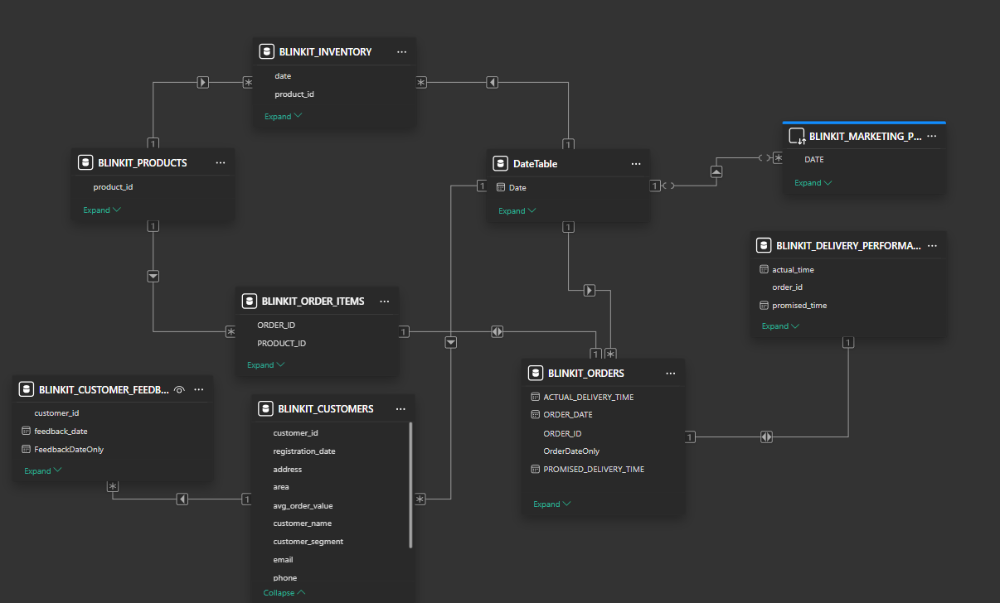
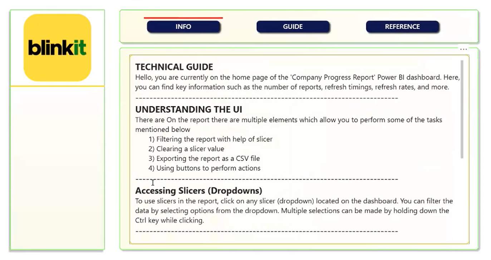
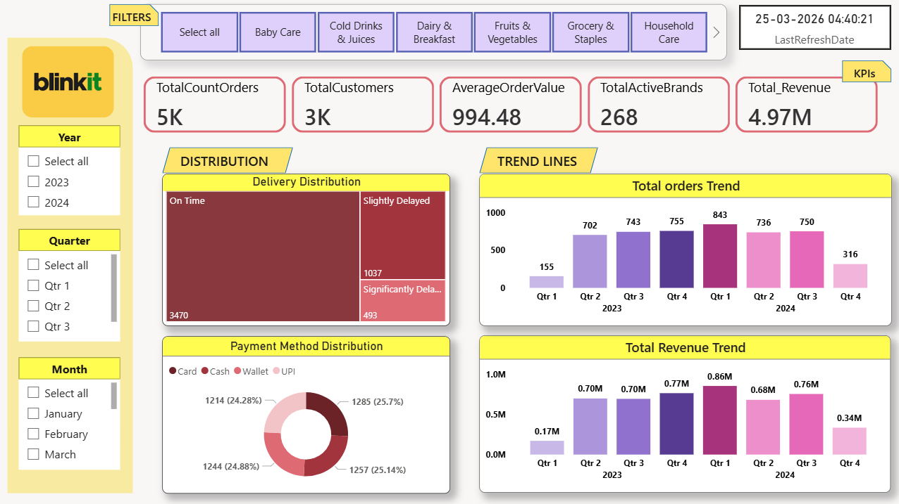
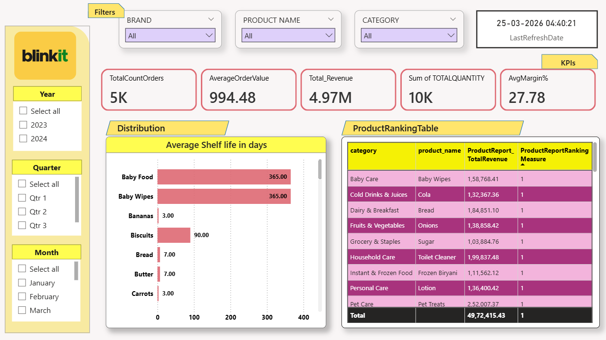
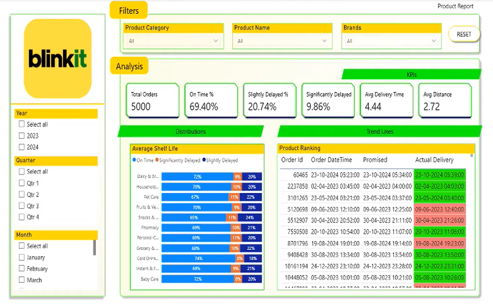
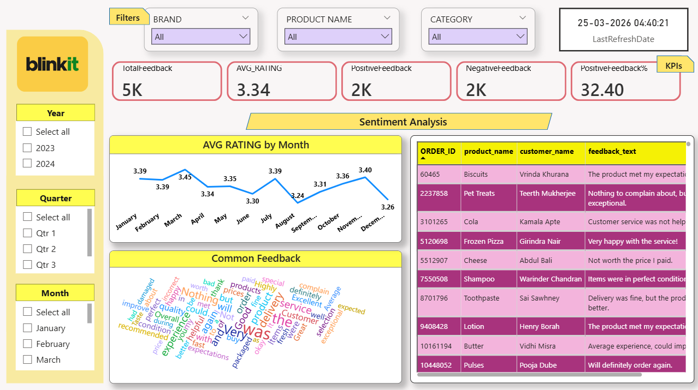
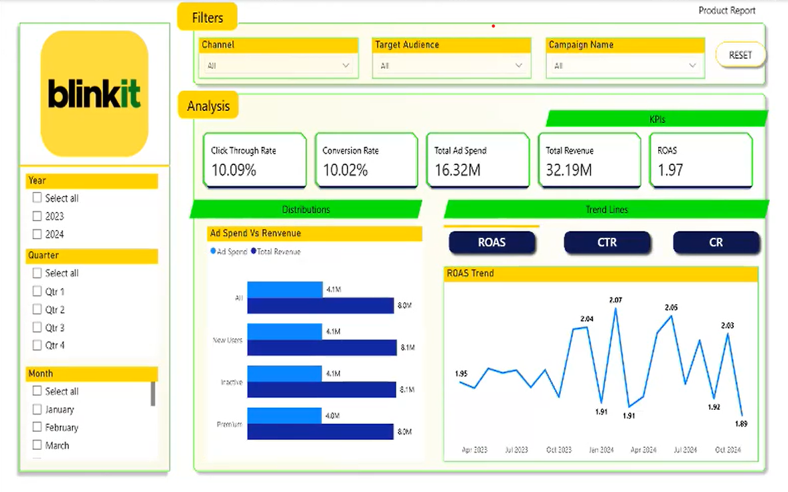

# 🛒 Blinkit Operations Analytics Dashboard

An interactive **Power BI dashboard** built to analyze operational, sales, delivery, customer, and marketing data for a quick-commerce business model inspired by **Blinkit**.

This project demonstrates how **business intelligence and data visualization** can help organizations monitor performance, identify operational inefficiencies, and make **data-driven decisions**.

---

# 📊 Project Overview

Quick commerce platforms process **thousands of orders daily**, making it challenging to track operations using traditional reporting methods.

This project builds a **centralized analytics dashboard** that enables stakeholders to:

- Monitor **sales performance**
- Track **product-level trends**
- Evaluate **delivery efficiency**
- Analyze **customer sentiment**
- Measure **marketing campaign effectiveness**

The goal is to transform raw operational data into **interactive visual insights using Power BI**.

---

# 🎯 Project Objectives

The dashboard was designed to solve key business problems:

✔ Track **inventory and order performance**  
✔ Monitor **delivery operations and delays**  
✔ Identify **top-performing products and categories**  
✔ Analyze **customer feedback and satisfaction**  
✔ Evaluate **marketing campaign ROI**

---

# 🧰 Tech Stack

| Tool | Purpose |
|-----|------|
| Power BI | Interactive dashboard and visualization |
| DAX | KPI calculations and metrics |
| MySQL | Data storage and SQL queries for inventory data |
| Snowflake | Cloud data warehouse for analytical queries |
| SharePoint | Data source for CSV datasets |
| Power Query | Data transformation and cleaning |

---

# 📈 Dashboard Reports

The Power BI solution consists of **five key analytical dashboards**.

---

## 📌 Summary Report

Provides a **high-level overview of business performance**.

**Key Metrics**

- Total Orders  
- Total Revenue  
- Average Order Value  
- Unique Customers  
- Sales Trends Over Time  

Used by stakeholders to track **revenue growth and customer activity**.

---

## 📌 Product Performance Dashboard

Analyzes **product-level performance** to identify top revenue drivers.

**Key Metrics**

- Total Products Sold  
- Product Revenue  
- Top Selling Products  
- Category Distribution  
- Average Margin Percentage  

Helps businesses understand **which products drive the most sales**.

---

## 📌 Delivery Performance Dashboard

Focuses on **logistics and delivery operations**.

**Key Metrics**

- Total Deliveries  
- On-Time Deliveries  
- Late Deliveries  
- On-Time Delivery %  
- Average Delivery Time  
- Average Distance Covered  

Provides insights into **delivery efficiency and operational bottlenecks**.

---

## 📌 Customer Feedback & Sentiment Dashboard

Analyzes **customer reviews and satisfaction trends**.

**Key Metrics**

- Total Feedback  
- Average Rating  
- Positive Feedback  
- Negative Feedback  
- Positive Feedback Rate  

Helps businesses improve **customer experience and service quality**.

---

## 📌 Marketing Performance Dashboard

Evaluates **digital marketing campaign effectiveness**.

**Key Metrics**

- Total Impressions  
- Total Clicks  
- Total Conversions  
- Click Through Rate (CTR)  
- Conversion Rate  
- Campaign Revenue  
- Ad Spend  
- Return on Ad Spend (ROAS)

Provides insights into **which campaigns generate the highest ROI**.

---

# 🖼️ Dashboard Preview

### Data Model 1

### Data Model 2

### Home Page

### Summary Report

### Product Performance Report

### Delivery Performance Report

### Customer Feedback & Sentiment Analysis Report

### Marketing Performance Report

---

# 💡 Key Insights Generated

The dashboard helps uncover insights such as:

- High-performing **product categories**
- Regions with **higher delivery delays**
- Correlation between **marketing spend and conversions**
- Customer satisfaction patterns
- Sales trends across time periods

---
